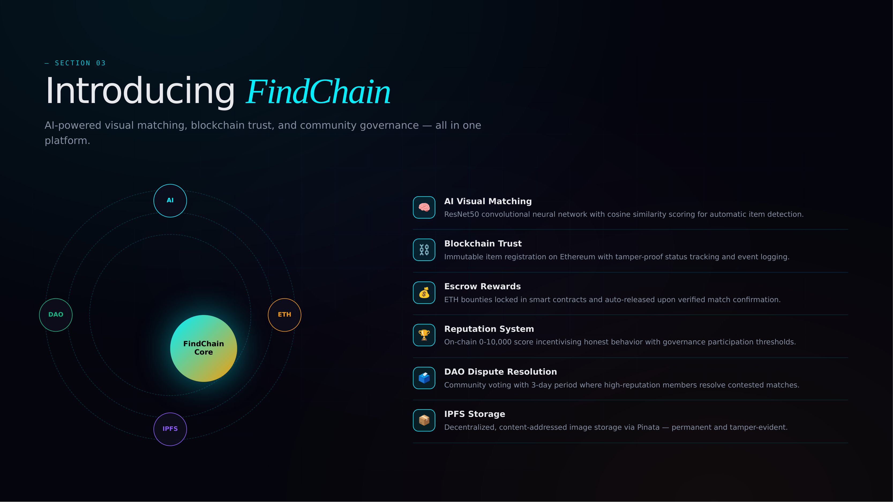
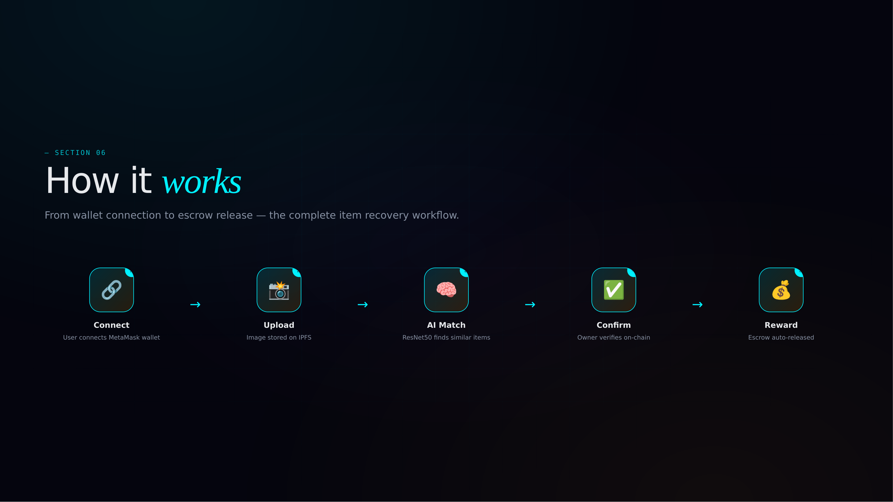
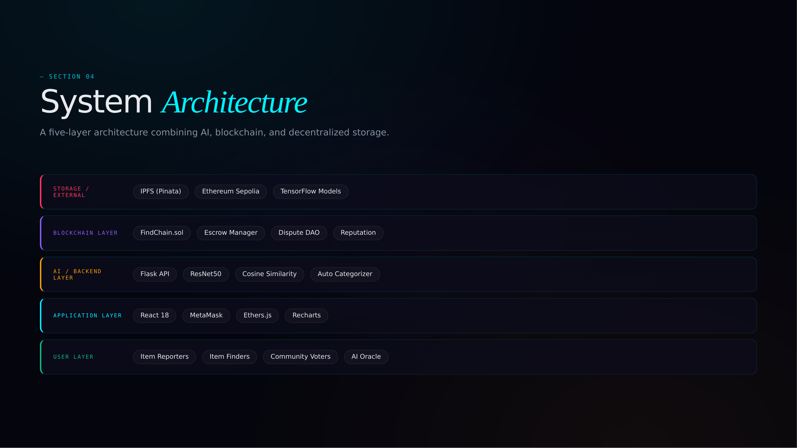
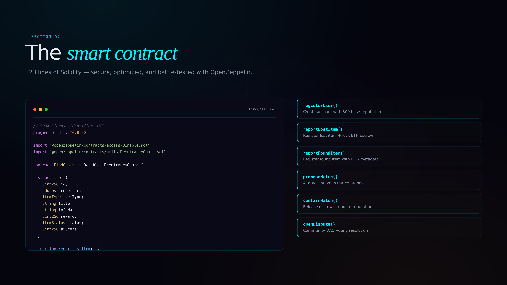

<div align="center">

<br />

```
███████╗██╗███╗   ██╗██████╗  ██████╗██╗  ██╗ █████╗ ██╗███╗   ██╗
██╔════╝██║████╗  ██║██╔══██╗██╔════╝██║  ██║██╔══██╗██║████╗  ██║
█████╗  ██║██╔██╗ ██║██║  ██║██║     ███████║███████║██║██╔██╗ ██║
██╔══╝  ██║██║╚██╗██║██║  ██║██║     ██╔══██║██╔══██║██║██║╚██╗██║
██║     ██║██║ ╚████║██████╔╝╚██████╗██║  ██║██║  ██║██║██║ ╚████║
╚═╝     ╚═╝╚═╝  ╚═══╝╚═════╝  ╚═════╝╚═╝  ╚═╝╚═╝  ╚═╝╚═╝╚═╝  ╚═══╝
```

### *AI-Powered Decentralized Lost & Found*

**Computer vision matches your lost item. Smart contracts handle the reward. Community resolves disputes.**

<br />

[](https://soliditylang.org)
[](https://react.dev)
[](https://tensorflow.org)
[](https://sepolia.etherscan.io)
[](https://pinata.cloud)
[](LICENSE)

</div>



---

## Features

- **AI Visual Matching** — ResNet50 convolutional neural network with cosine similarity scoring for automatic item detection
- **Blockchain Trust** — Immutable item registration on Ethereum with tamper-proof status tracking and event logging
- **Escrow Rewards** — ETH bounties locked in smart contracts and auto-released upon verified match confirmation
- **Reputation System** — On-chain 0-10,000 score incentivizing honest behavior with governance participation thresholds
- **DAO Dispute Resolution** — Community voting with 3-day period where high-reputation members resolve contested matches
- **IPFS Storage** — Decentralized, content-addressed image storage via Pinata — permanent and tamper-evident
- **Interactive Map** — Leaflet-based map view with real GPS markers for all reported items
- **Analytics Dashboard** — Charts for monthly trends, category breakdown, resolution rates, and recent activity

---

## The Problem with Traditional Lost & Found

Every airport, mall, and transit system runs its own isolated lost-and-found silo. Matching is manual. There's no incentive for finders to return items. Ownership claims can't be verified. And there's no trust between strangers.

FindChain replaces all of that with a unified system: AI matches items by visual similarity, blockchain escrows the reward, and the community resolves disputes — no central authority required.

---

## How It Works

```
1.  Owner loses an item
    └─ Reports it with a photo + optional ETH reward locked in escrow

2.  Finder discovers an item
    └─ Reports it with a photo

3.  AI engine kicks in
    └─ ResNet50 extracts visual features from both images
    └─ Weighted similarity score computed (visual + category + GPS)
    └─ Match proposed on-chain if score clears threshold

4.  Owner confirms the match
    └─ Escrow releases reward directly to the finder (minus 2% platform fee)

5.  Dispute? Community decides
    └─ Either party opens a dispute with evidence
    └─ Users with 100+ reputation vote within a 3-day window
    └─ Contract finalizes outcome — no admin override
```



---

## Architecture



```
┌─────────────────────────────────────────────────────────────┐
│                  React 18 Frontend (Vite)                   │
│            ethers.js · Recharts · Lucide Icons              │
└──────────────────────────┬──────────────────────────────────┘
                           │
           ┌───────────────┼───────────────┐
           │               │               │
           ▼               ▼               ▼
┌─────────────────┐ ┌─────────────┐ ┌──────────────────────┐
│   AI Service    │ │ IPFS/Pinata │ │  FindChain.sol       │
│                 │ │             │ │  (Ethereum Sepolia)  │
│  Python Flask   │ │  Images +   │ │                      │
│  ResNet50       │ │  Metadata   │ │  Item registry       │
│  Feature store  │ │  (CID only  │ │  Escrow & rewards    │
│  Matching API   │ │  on-chain)  │ │  Dispute voting      │
│                 │ │             │ │  Reputation system   │
└─────────────────┘ └─────────────┘ └──────────────────────┘
```

---

## AI Matching Algorithm

Each match is scored across three signals:

```
Final Score = (Visual Similarity × 0.60)
            + (Category Match   × 0.20)
            + (GPS Proximity    × 0.20)
```

| Signal | Method | Detail |
|---|---|---|
| **Visual Similarity** | ResNet50 cosine similarity | 2048-dim feature vector per image |
| **Category Match** | Keyword classification | Auto-categorized from item description |
| **GPS Proximity** | Haversine distance | Score of 1.0 within 1 km, decays to 0 at 50 km |

The AI service exposes a clean REST API for the frontend and contract to consume:

| Endpoint | Method | Description |
|---|---|---|
| `/api/health` | `GET` | Service health check |
| `/api/extract-features` | `POST` | Extract and store visual features for an item |
| `/api/find-matches` | `POST` | Find potential matches above similarity threshold |
| `/api/compare` | `POST` | Direct image-to-image comparison |
| `/api/categorize` | `POST` | Auto-categorize item from description text |

---

## Smart Contract — `FindChain.sol`



Deployed on Ethereum Sepolia. Built with OpenZeppelin's `Ownable` and `ReentrancyGuard`.

| Function | Description | Caller |
|---|---|---|
| `registerUser()` | Create profile with base reputation (500) | Anyone |
| `reportLostItem(...)` | Report lost item, lock ETH reward in escrow | Registered users |
| `reportFoundItem(...)` | Report found item with photo CID | Registered users |
| `proposeMatch(...)` | Propose AI-detected match with similarity score | Contract owner |
| `confirmMatch(id)` | Confirm match, release escrow to finder minus 2% fee | Lost item reporter |
| `openDispute(...)` | Dispute a proposed match with supporting evidence | Match parties |
| `voteOnDispute(...)` | Cast vote on active dispute (3-day window) | Users with 100+ reputation |
| `resolveDispute(id)` | Finalize dispute after voting period ends | Anyone |

**Reputation system (0–10,000):** Gates dispute voting to prevent Sybil attacks. Successful matches increase reputation; fraudulent claims reduce it.

---

## Project Structure

```
findchain/
├── contracts/
│   └── FindChain.sol              # Main smart contract
│
├── scripts/
│   ├── deploy.js                  # Deployment script
│   └── test-live.js               # Full-flow live simulation
│
├── test/
│   └── FindChain.test.js          # Hardhat unit tests
│
├── ai-service/
│   ├── app.py                     # Flask AI matching server
│   └── requirements.txt
│
├── frontend/
│   ├── src/
│   │   ├── FindChain.jsx          # Main React app
│   │   └── main.jsx
│   ├── index.html
│   └── vite.config.js
│
├── hardhat.config.js
├── run.bat                        # One-click setup + launch (Windows)
├── setup.bat / setup.sh           # Dependency installer
├── start.bat                      # Quick start (Windows)
└── test-live.bat                  # Run live blockchain test
```

---

## Getting Started

### Prerequisites

- Node.js 18+
- Python 3.9+ (optional — for AI matching service)
- MetaMask browser extension

---

### Quick Start (Windows)

```bash
run.bat
```

Handles everything automatically: dependency install, contract compilation, unit tests, local Hardhat node, deployment, and frontend launch.

---

### Quick Start (Mac / Linux)

```bash
chmod +x setup.sh
./setup.sh

# then in separate terminals:
npx hardhat node
npx hardhat run scripts/deploy.js --network localhost
cd frontend && npm run dev
```

---

### Manual Setup

```bash
# 1. Clone
git clone https://github.com/YashejShah/FindChain.git
cd FindChain

# 2. Install dependencies
npm install
cd frontend && npm install && cd ..

# 3. Compile contracts
npx hardhat compile

# 4. Run unit tests
npx hardhat test

# 5. Start local blockchain  [Terminal 1]
npx hardhat node

# 6. Deploy to local node   [Terminal 2]
npx hardhat run scripts/deploy.js --network localhost

# 7. Start frontend         [Terminal 3]
cd frontend && npm run dev
```

---

### MetaMask Setup

Once the frontend is running, add the local Hardhat network to MetaMask:

| Setting | Value |
|---------|-------|
| Network Name | Hardhat Local |
| RPC URL | `http://127.0.0.1:8545` |
| Chain ID | `1337` |
| Symbol | ETH |

Import any Hardhat test account using the private keys printed in the hardhat node terminal. Each account has 10,000 test ETH.

---

### AI Service (Optional)

```bash
cd ai-service
pip install -r requirements.txt
python app.py
# Runs on http://localhost:5000
```

---

### Sepolia Testnet Deployment

Copy `.env.example` to `.env` and populate:

```env
PRIVATE_KEY=<your-wallet-private-key>
SEPOLIA_RPC_URL=<infura-or-alchemy-endpoint>
ETHERSCAN_API_KEY=<for-contract-verification>
PINATA_API_KEY=<pinata-key>
PINATA_SECRET_KEY=<pinata-secret>
```

Then deploy:

```bash
npx hardhat run scripts/deploy.js --network sepolia
```

---

## Testing

```bash
# Unit tests
npx hardhat test

# Full live flow simulation
npx hardhat run scripts/test-live.js
```

The live simulation runs end-to-end: deploys the contract, registers 3 users, reports lost and found items, proposes an AI match at **92% similarity**, confirms the match with escrow payout, and opens a community dispute with voting.

---

## Tech Stack

| Layer | Technology |
|---|---|
| **Smart Contracts** | Solidity 0.8.20, OpenZeppelin 5.x |
| **Blockchain** | Ethereum — Hardhat local / Sepolia testnet |
| **Dev Framework** | Hardhat, ethers.js v6 |
| **AI / ML** | TensorFlow, Keras, ResNet50 |
| **AI Backend** | Python Flask |
| **Frontend** | React 18, Vite 5, Leaflet, Recharts, Lucide |
| **Storage** | IPFS via Pinata |
| **Wallet** | MetaMask |

---

## Contributors

| Name | GitHub | Role |
|------|--------|------|
| Yashej Shah | [@YashejShah](https://github.com/YashejShah) | Smart contracts, AI service, frontend, deployment scripts |
| Tanu Somani | [@Tanu-somani](https://github.com/Tanu-somani) | Problem research, use-case analysis, testing, design documentation |

---

## License

This project is licensed under the MIT License. See [LICENSE](LICENSE) for details.

---

<div align="center">

Built with TensorFlow · Solidity · React · IPFS · Ethereum

</div>
